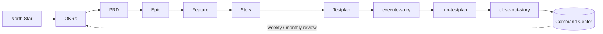

<div align="center">

# Tandem

**Tandem — the Claude Code project-management plugin.** Your co-pilot for shipping ideas without the chaos.

[](https://github.com/DATA-AI-XYZ/Tandem/releases)
[](LICENSE)
[](https://code.claude.com/docs/en/plugins)

[**▶ Live demo — the Tandem Command Center**](https://data-ai-xyz.github.io/Tandem/)

</div>

---

Tandem is a Claude Code plugin that takes you from idea to production — without the chaos. You drive the whole plan with slash commands; Tandem makes sure nothing slips: no stories go in-progress without a testplan, no work ships without passing its gates, no decision disappears into the chat log. The result is a team-quality delivery rhythm, at solo-founder pace.

---

## How it works

Tandem installs a `_00-Project-Management/` scaffold into your project and registers a set of `/Tandem:*` skills that cover the full North Star → Done lifecycle. Two hooks keep everything honest: a linter that runs on every PM file edit, and a generator that rebuilds an interactive HTML **Command Center** whenever your plan changes. Both hooks run a single stdlib-only Node entrypoint (`node ${CLAUDE_PLUGIN_ROOT}/_00-Project-Management/93-Scripts/hook.js`) directly — no `npm` step is involved.

It's **stack-agnostic** — the bootstrap asks what you're building (web, mobile, CLI, library, backend, data-pipeline, Power Platform, or automation) and tailors the guidance to match.

### Why it's different from "AI project management"

Most "AI project management" is a chat log. Tandem is a contract:

- **Closed-set status enum** — exactly nine statuses, never invented ad-hoc, so every board reads the same.
- **Story ↔ Testplan pairing (enforced)** — you cannot create a Story without a paired Testplan where every acceptance criterion maps to a runnable test case. No "trust me, it works."
- **DoR / DoD gates** — work can't enter *in-progress* without meeting Definition of Ready, and can't reach *done* without Definition of Done. The gates are checked, not assumed.
- **ADR-on-the-spot** — every non-obvious decision becomes an Architecture Decision Record in the same edit, so the *why* is never lost.
- **Auto bug-raising** — the moment a test case fails, a structured BUG file is filed before the failure is even reported back to you.
- **A living Command Center** — a single self-contained HTML view of your entire plan, regenerated automatically. (That's the [live demo](https://data-ai-xyz.github.io/Tandem/) above.)

## The lifecycle



Every arrow is a slash command. Every box is a markdown artefact in your repo.

## Install

```bash
# 1. Add the Tandem marketplace
/plugin marketplace add DATA-AI-XYZ/Tandem

# 2. Install the plugin
/plugin install Tandem@DATA-AI-XYZ

# 3. Bootstrap it into your project (drops _00-Project-Management/, wires hooks, seeds CLAUDE.md)
/Tandem:session-start
```

On install Tandem will:

1. Drop the `_00-Project-Management/` scaffold into your project root (if absent).
2. Register the `/Tandem:*` skills covering the full North Star → Done lifecycle.
3. Enable two hooks — lint-on-edit and Command-Center-regen-on-stop.
4. Insert a slim PM rules block into your root `CLAUDE.md` (idempotent, under a managed marker).

> No plugin access? Tandem also ships a paste-prompt installer — see [`BOOTSTRAP-PROMPT.md`](BOOTSTRAP-PROMPT.md).

## Slash commands

| Command | Hat | When to use |
|---|---|---|
| `/Tandem:session-start` | any | Orient at the start of a session: read active work, recent ADRs, the board; announce the next step |
| `/Tandem:draft-okrs` | Founder | Draft quarterly OKRs from a North Star |
| `/Tandem:draft-prd` | Founder→PM | Draft a PRD from an OKR or raw notes |
| `/Tandem:draft-epic` | PM | Draft an Epic from an OKR key result or PRD section |
| `/Tandem:split-into-features` | PM | Decompose an Epic into Features |
| `/Tandem:split-into-stories` | PM | Decompose a Feature into Stories + paired Testplans |
| `/Tandem:refine-backlog` | PM | DoR gate — promote to *ready* or list the gaps; never silently promotes |
| `/Tandem:execution-strategist` | PM | Plan how to execute an Epic — group stories into batches with lanes & sub-agents |
| `/Tandem:execute-story` | Dev | Pull a *ready* Story into active work |
| `/Tandem:execute-batch` | Dev | Run a whole strategy "batch" of stories end-to-end |
| `/Tandem:run-testplan` | QA | Run every test case; auto-file BUGs on failure |
| `/Tandem:close-out-story` | QA→PM | DoD gate (incl. AI-code review) + board update |
| `/Tandem:weekly-monitor` | PM | Friday weekly summary; flag stalls and blocks |
| `/Tandem:monthly-retro` | Founder/PM | Monthly retrospective |
| `/Tandem:fill-claude-md` | any | Author/refresh `CLAUDE.md` files across the codebase |
| `/Tandem:reflect` | any | End-of-session reflection: propose improvements (you approve before applying) |
| `/Tandem:core` | — | Force-load the core PM rules (usually auto-loaded) |

Skills are model-invoked — Claude auto-loads them when your task matches — but explicit invocation always works.

## The Command Center

The headline feature. A single self-contained HTML file, regenerated from your markdown plan, with tabs for the plan tree, the monitor board, the execution strategy, and a glossary. It's built to be glanceable and stays current automatically (the Stop hook regenerates it whenever a PM file changes).

**[▶ Open the live demo](https://data-ai-xyz.github.io/Tandem/)** — generated from a fabricated sample project (not real data), so it's safe to share and explore.

<!-- Screenshots live under docs/ once generated:


-->

## What's inside

```
Tandem/
├── .claude-plugin/
│   ├── plugin.json            Manifest (name: Tandem)
│   └── marketplace.json       DATA-AI-XYZ marketplace listing
├── skills/                    The /Tandem:* skills (full lifecycle)
├── hooks/                     PostToolUse (lint) + Stop (Command-Center regen)
├── docs/                      Live-demo Command Center (GitHub Pages)
├── BOOTSTRAP-PROMPT.md        Paste-prompt installer (no-plugin path)
├── CONTRIBUTING.md · SECURITY.md · CHANGELOG.md · LICENSE
└── README.md
```

## Project types supported

`web-app` · `mobile` · `cli` · `library` · `backend-service` · `data-pipeline` · `power-platform` · `automation` — the bootstrap injects the matching gotchas and per-type guidance.

## Contributing & security

- [`CONTRIBUTING.md`](CONTRIBUTING.md) — how to propose changes.
- [`SECURITY.md`](SECURITY.md) — responsible disclosure.

## License

[MIT](LICENSE) — provided **"as is"**, without warranty of any kind (see [LICENSE](LICENSE) and [NOTICE.md](NOTICE.md)).

## Disclaimer

"Claude" and "Claude Code" are trademarks of Anthropic, PBC. Tandem is an independent project and is **not affiliated with, endorsed by, or sponsored by Anthropic**. Tandem runs locally; its scripts and hooks make **no network calls** and collect **no telemetry**. It creates and edits files under your project's `_00-Project-Management/` tree — review what it does and use it at your own risk. See [NOTICE.md](NOTICE.md) for full details.

## Contact

- Web: <https://www.dataxyzconnect.com>
- Email: info@dataxyzconnect.com · Maintained by DATA-AI-XYZ
