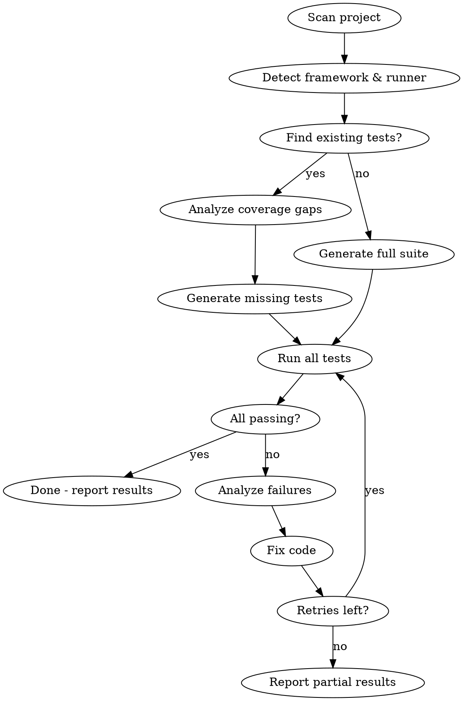

# TestPilot - Autonomous Testing Autopilot

Run `/testpilot` to let the AI fully handle your testing workflow end-to-end.

## What It Does

1. **Detect** - Scans your project to identify framework, language, existing tests, and test runner
2. **Generate** - Creates comprehensive test suites (unit + integration + E2E as appropriate)
3. **Run** - Executes all tests
4. **Fix** - If tests fail, reads errors, fixes the tests OR the source code (your choice)
5. **Re-run** - Loops until all tests pass or max retries hit (default: 5)

## Usage

```
/testpilot                    # Full autonomous run on entire project
/testpilot src/auth           # Target specific directory
/testpilot --fix-tests-only   # Only fix test code, never touch source
/testpilot --fix-source       # Fix source code when tests reveal bugs
/testpilot --max-retries 3    # Limit fix-rerun cycles
/testpilot --dry-run          # Generate tests but don't run them
```

## Process



## Detection Matrix

| Signal | Framework | Test Runner | Test Style |
|--------|-----------|-------------|------------|
| package.json + react | React | Jest/Vitest | RTL + unit |
| package.json + next | Next.js | Jest/Vitest + Playwright | Unit + E2E |
| package.json + express/fastify | Node API | Jest/Vitest + supertest | API + unit |
| pyproject.toml / setup.py | Python | pytest | Unit + integration |
| build.gradle.kts + android | Android/Kotlin | JUnit + Espresso | Unit + UI |
| Cargo.toml | Rust | cargo test | Unit + integration |
| go.mod | Go | go test | Table-driven tests |
| pom.xml / build.gradle | Java/Spring | JUnit + MockMvc | Unit + API |
| *.ts + no framework | TypeScript | Vitest | Unit |
| docker-compose.yml | Any + infra | Existing + testcontainers | Integration |

## Execution Rules

1. **Never delete existing passing tests** - only add new ones or fix broken ones
2. **Prefer the project's existing test patterns** - match style, naming, structure
3. **Install missing test dependencies automatically** - but ASK before adding new frameworks
4. **Create test files next to source** or in `__tests__`/`tests` dir matching project convention
5. **Each fix attempt must be different** - don't retry the same fix twice
6. **Report what was generated, what passed, what failed, and what was fixed**

## Output

After completion, TestPilot prints:

```
TestPilot Report
================
Project:     my-app (Next.js + TypeScript)
Test Runner: vitest
Generated:   12 test files, 47 test cases
Passed:      45/47
Fixed:       2 failures (1 test fix, 1 source bug fix)
Retries:     1
Coverage:    Routes: 8/8, Components: 12/15, Utils: 6/6
Time:        34s
```
